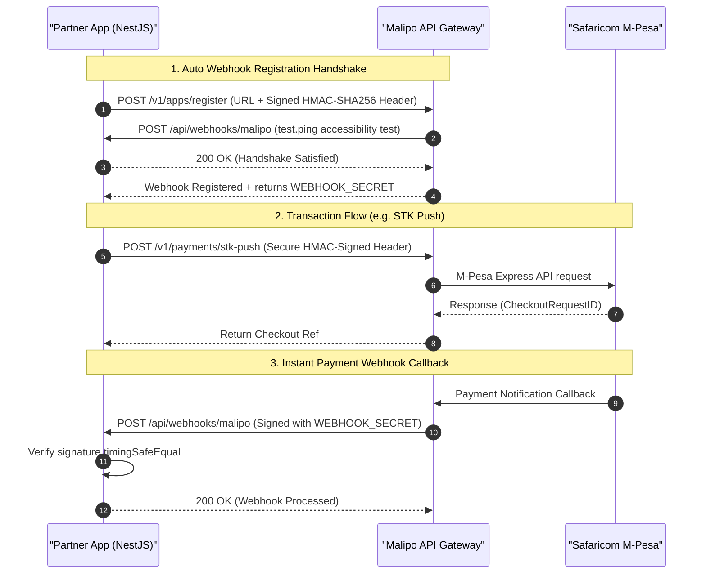

# 🚀 Malipo Platform Integration Client (NestJS)

A progressive, production-ready NestJS integration service demonstrating how merchant partners and external applications securely interface with the **Malipo Payment Gateway**.

This client is fully typed and engineered using NestJS module architectures, featuring automated secure webhook handshakes, request integrity signature generation, and transactional handlers powered by `@nestjs/axios`.

---

## 🏗️ System Flow & Architecture

The sequence below illustrates the automatic handshake registration and payment processing lifecycle between your integration app, the Malipo Gateway, and mobile money providers (e.g. Safaricom M-Pesa):



---

## ⚙️ Environment Configurations

Create a local `.env` file in the root of the project by copying [.env.example](file:///Users/briankoech/coding/malipo/nest-integration/.env.example):

```env
# Application Host Port
APP_PORT=3333

# Malipo Public API Access Credentials
MALIPO_API_KEY=pk_sandbox_...
MALIPO_API_SECRET=sk_sandbox_...
MALIPO_API_URL=http://localhost:3000

# Webhook configuration for local reception and automatic registration
MALIPO_WEBHOOK_URL=http://localhost:3333/api/webhooks/malipo
MALIPO_WEBHOOK_SECRET=
```

---

## 📖 API Endpoints Directory

All local endpoints are mounted behind the `/api` prefix (configured dynamically in `main.ts`).

| Method | Endpoint | Request Payload | Description |
| :--- | :--- | :--- | :--- |
| **GET** | `/api` | _None_ | **Active Healthcheck**: Simple check to verify the integration client is listening. |
| **POST** | `/api/payments/stk-push` | `{ amount: number, phone: string, description: string, channel?: string }` | **STK Push (LIPA NA M-PESA)**: Triggers Safaricom M-Pesa STK push pop-up request to user's phone. |
| **POST** | `/api/qr/generate` | `{ amount: number, description?: string }` | **Dynamic QR Code**: Generates a standard payment QR code representation of the order. |
| **POST** | `/api/payments/simulate-c2b` | `{ amount: number, phone: string, bill_ref_number: string }` | **C2B Paybill Simulation**: Simulates a payment directly to your configured Paybill number. |
| **POST** | `/api/payments/withdraw` | `{ amount: number, phone: string, reason?: string }` | **B2C Disbursement**: Initiates secure outgoing payouts from your ledger account to a phone number. |
| **POST** | `/api/webhooks/malipo` | _Gateway Payload + Custom Headers_ | **Webhook Listener**: Authenticates, parses, and processes transaction callbacks sent by the Gateway. |

---

## 🛡️ Security & Request Verification

### 1. Request Signature (HMAC-SHA256)
Every outgoing request dispatched by `AppService` is cryptographically signed using your `MALIPO_API_SECRET` to prevent tampering:
*   Generates a Unix timestamp (`X-Timestamp`) to prevent replay attacks.
*   Signs the combined payload string (`timestamp.bodyStr`) using `HMAC-SHA256`.
*   Includes `X-API-Key`, `X-Timestamp`, and `X-API-Signature` in headers.

### 2. Webhook Integrity Handshake
Upon receiving callbacks on `/api/webhooks/malipo`, `WebhookController` verifies payload origin:
*   Extracts `X-Webhook-Signature` from headers.
*   Calculates a locally computed signature using the session's `webhookSecret` returned during registration.
*   Applies a constant-time comparison `crypto.timingSafeEqual` to avoid timing side-channel exploits.

---

## 🚀 Execution & Command Operations

Navigate to this directory in your terminal and execute:

#### 1. Setup & Installation
```bash
pnpm install
```

#### 2. Run Locally in Watch Mode
```bash
pnpm run start:dev
```

#### 3. Compile and Build Production Bundle
```bash
pnpm run build
```

#### 4. Run Test Suites
```bash
# Unit Tests
pnpm run test

# End-to-End Tests
pnpm run test:e2e
```
